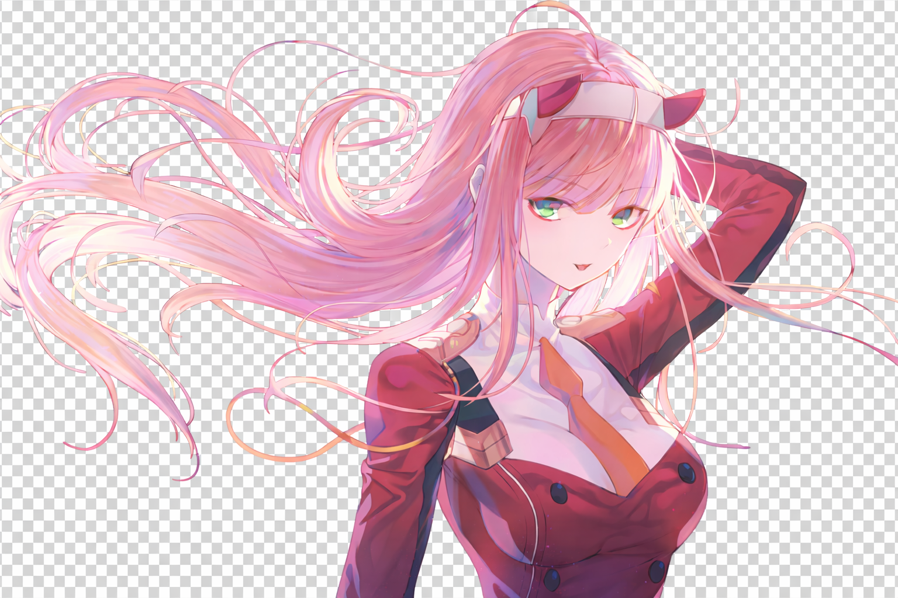

<div align="center">
  <a href="https://github.com/Shineii86/AniPay">
    
  </a>
  
# [AniPay](https://github.com/Shineii86/AniPay)

A stunning anime-inspired payment gateway interface featuring Zero Two (Code:002) from Darling in the Franxx. This project combines beautiful UI design with functional payment methods for both Indian and international users.

[](https://shineii86.github.io/AniPay/)


 [](https://github.com/Shineii86/AniPay/stargazers) [](https://github.com/Shineii86/AniPay/fork)

  <a href="https://github.com/Shineii86/AniPay">
    
  </a>

</div>

##  Features

- **Zero Two Themed UI**
  - [x] Beautiful pink and teal color scheme inspired by Zero Two
  - [x] Particle animation background with anime.js
  - [x] Responsive design for all devices
  
- **Payment Methods**
  - **Indian Payments**
    - [x] QR Code payment with download option
    - [x] UPI payment with copy functionality
  - **International Payments**
    - [x] Binance ID
    - [x] Bybit ID
    - [x] Tonkeeper address

- **Advanced Animations**
  - [x] Smooth entrance animations for all elements
  - [x] Interactive button hover effects
  - [x] Particle system background
  - [x] Notification system

- **Modern Technologies** 🔧
  - [x] Built with pure HTML, CSS, and JavaScript
  - [x] Uses anime.js for advanced animations
  - [x] Josefin Sans font for elegant typography

ㅤㅤ
  <a href="https://github.com/Shineii86/AniPay">
    
  </a>

##  Getting Started

1. **Clone the repository**
   ```bash
   git clone https://github.com/Shimeii86/AniPay.git
   ```

2. **Open the project**
   ```bash
   cd AniPay
   ```

3. **Open index.html in your browser**
   - Simply double-click the `index.html` file
   - Or run a local server:
     ```bash
     python -m http.server
     ```
     Then visit `http://localhost:8000`

  <a href="https://github.com/Shineii86/AniPay">
    
  </a>

##  Customization

1) Change Payment Details
Edit the payment details in the HTML file:
```html
<!-- Indian UPI ID -->
<div class="id-display">
  shinei@anipay
</div>

<!-- Binance ID -->
<div class="id-display">
  853904044
</div>

<!-- Bybit ID -->
<div class="id-display">
  199911528
</div>

<!-- Tonkeeper Address -->
<div class="id-display">
  UQBmK_-2A-gHnhx0hmWdFeQc8X7iZ0O_UkxQbQGU2uA6OwmX
</div>
```

2) Modify Colors
Edit the CSS variables in the style section:
```css
:root {
  --primary: #ff2a6d;      /* Pink color */
  --secondary: #5ffbf1;    /* Teal color */
  --dark-bg: #0c0c1d;      /* Dark background */
}
```

3) Adjust Animations
Modify the anime.js parameters in the script section:
```javascript
// Particle count
const particleCount = 150;  /* Increase for more particles */

// Title animation
anime({
  targets: '.title',
  opacity: [0, 1],
  translateY: [-30, 0],
  duration: 1500,          /* Animation duration */
  easing: 'easeOutExpo'
});
```
  <a href="https://github.com/Shineii86/AniPay">
    
  </a>

##  How to Add QR Code by URL
I've implemented QR code integration using an external URL. Here's how it works:

1) QR Code Generation:

```html

```

2) URL Parameters Explained:
- [x] `size=150x150`: Sets the dimensions of the QR code
- [x] `data=upi://pay?pa`=...: Contains the UPI payment details
- [x] `pn=Zero%20Two%20Pay`: Sets the payee name
- [x] `mc=0000`: Merchant code
- [x] `mode=02`: Transaction mode

4) Download Functionality:
```javascript
document.getElementById('download-qr').addEventListener('click', function() {
    const qrImage = document.getElementById('qr-image');
    const imageUrl = qrImage.src;
    
    // Create a temporary link
    const link = document.createElement('a');
    link.href = imageUrl;
    link.download = 'anipay-qrcode.png';
    document.body.appendChild(link);
    link.click();
    document.body.removeChild(link);
    
    showNotification('QR Code downloaded!');
});
```

4) Copy to Clipboard:
```javascript
document.querySelectorAll('.copy-btn').forEach(button => {
    button.addEventListener('click', function() {
        const targetId = this.getAttribute('data-target');
        const textElement = document.getElementById(targetId);
        const text = textElement.textContent;
        
        navigator.clipboard.writeText(text).then(() => {
            showNotification('Copied to clipboard!');
        });
    });
});
```

  <a href="https://github.com/Shineii86/AniPay">
    
  </a>

##  Technologies Used

- **Frontend**
  
  
  
  
- **Libraries**
  
  

- **Fonts**
  

---

  <a href="https://github.com/Shineii86/AniPay">
    
  </a>

##  License
This project is licensed under the MIT License - see the [LICENSE](LICENSE) file for details.

##  Loved My Work?

&nbsp;[Give a star to this project](https://github.com/Shineii86/AniPay/) <br/>
&nbsp;[Follow me on GitHub](https://github.com/Shineii86/Shineii86)<br/>

>  Wondering where to get these animated emojis?
> [Visit here!](https://github.com/Shineii86/AniEmojis) You also should look around my other github repos. Maybe you'll find some cool useful stuff there.

  <a href="https://github.com/Shineii86/AniPay">
    
  </a>

##  Contact

<div align="center">
  
  *For inquiries or collaborations:*
     
[](https://telegram.me/Shineii86 "Contact on Telegram")
[](https://instagram.com/ikx7.a "Follow on Instagram")
[](https://pinterest.com/ikx7a "Follow on Pinterest")
[](mailto:ikx7a@hotmail.com "Send an Email")

  <sup><b>Copyright © 2025 <a href="https://telegram.me/Shineii86">Shinei Nouzen</a> All Rights Reserved</b></sup>

</div>
