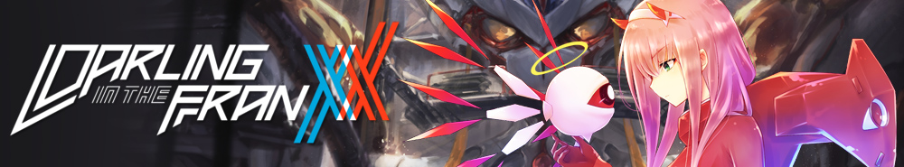

<div align="center">

  <a href="https://github.com/Shineii86/AniPay">
    
  </a>

  <br><br>

  # ✨ AniPay

  **Darling in the Franxx Inspired Payment Gateway**

  A beautiful, anime-themed profile page with social links, posts, and payments.<br>
  One config file. Full customization. Zero code changes needed.

  <br>

  [](https://shineii86.github.io/AniPay/)
  
  
  
  
  [](https://github.com/Shineii86/AniPay/stargazers)
  [](https://github.com/Shineii86/AniPay/fork)

  <br>

  <a href="https://github.com/Shineii86/AniPay">
    
  </a>

</div>

---

## 🎯 What is AniPay?

AniPay is a **single-page personal profile & payment gateway** with an anime aesthetic. It combines a **Twitter-style profile**, **social media links**, **Instagram-style posts**, and **multi-method payments** — all controlled by one config file.

Fork it → edit `config.js` → done. No HTML. No build tools.

<table>
  <tr>
    <td align="center"><strong>👤 Profile</strong></td>
    <td align="center"><strong>🔗 Socials</strong></td>
    <td align="center"><strong>📸 Posts</strong></td>
    <td align="center"><strong>💳 Payments</strong></td>
  </tr>
  <tr>
    <td align="center">Twitter/X style<br>Banner, avatar, bio<br>Verified badge, stats</td>
    <td align="center">34 platforms<br>Enable/disable any<br>Hover color effects</td>
    <td align="center">Instagram grid<br>Carousel + lightbox<br>Configurable columns</td>
    <td align="center">11 methods<br>3 categories<br>Copy, QR, links</td>
  </tr>
</table>

---

## 📸 Screenshots

<div align="center">
  <a href="https://github.com/Shineii86/AniPay">
    
  </a>
  <a href="https://github.com/Shineii86/AniPay">
    
  </a>
</div>

---

## 🚀 Quick Start

```bash
# 1. Fork this repo on GitHub

# 2. Clone your fork
git clone https://github.com/YOUR_USERNAME/AniPay.git
cd AniPay

# 3. Open in browser (no build step needed)
open index.html
# or
python3 -m http.server 8000
```

**That's it.** No npm install. No build tools. Pure HTML + CSS + JS.

---

## ✨ Features

### 👤 Twitter/X-Style Profile

| Feature | Description |
|---------|-------------|
| **Banner Image** | Full-width banner with gradient overlay |
| **Profile Avatar** | Circular avatar with border and hover effect |
| **Verified Badge** | Blue checkmark — toggle on/off |
| **Display Name + Username** | Bold name + muted handle |
| **Bio** | Multi-line bio text |
| **Bio Link** | Clickable link with icon |
| **Location** | Location with map pin icon |
| **Join Date** | Calendar icon + date text |
| **Stats** | Posts / Followers / Following — animated counters |

### 🔗 Social Media Icons

**34 platforms** with per-platform enable/disable:

<details>
<summary><strong>Developer & Code</strong></summary>

GitHub · CodePen · Dev.to · Hashnode · Stack Overflow · Figma

</details>

<details>
<summary><strong>Social Networks</strong></summary>

X / Twitter · Instagram · Threads · Bluesky · Mastodon · Facebook · LinkedIn · Pinterest · Snapchat · Reddit

</details>

<details>
<summary><strong>Messaging</strong></summary>

Telegram · Discord · WhatsApp · Signal

</details>

<details>
<summary><strong>Streaming & Content</strong></summary>

YouTube · TikTok · Twitch · Spotify

</details>

<details>
<summary><strong>Design & Creative</strong></summary>

Dribbble · Behance · Medium · Steam

</details>

<details>
<summary><strong>Support & Donations</strong></summary>

Buy Me a Coffee · Ko-fi · Patreon · PayPal · Email

</details>

Each icon shows a **tooltip on hover** and changes to the **platform's brand color**.

### 📸 Instagram-Style Posts

| Feature | Description |
|---------|-------------|
| **Grid Layout** | Configurable columns: 2, 3, or 4 |
| **Single Images** | One image per post |
| **Carousel** | Multiple images with swipe/dots navigation |
| **Likes Overlay** | Heart + count shown on hover |
| **Lightbox** | Click to expand — prev/next, keyboard arrows, touch swipe |
| **Carousel Indicator** | Image count badge on multi-image posts |

### 💳 Payment Methods

<details>
<summary><strong>🇮🇳 India (3 methods)</strong></summary>

| Method | Type | Features |
|--------|------|----------|
| UPI QR Code | QR | Scan & pay, download QR |
| UPI ID | ID | Copy to clipboard |
| PhonePe | URL | Direct app link |

</details>

<details>
<summary><strong>🌍 International (3 methods)</strong></summary>

| Method | Type | Features |
|--------|------|----------|
| PayPal | URL | PayPal.Me link |
| Buy Me a Coffee | URL | Support link |
| Ko-fi | URL | Tip link |

</details>

<details>
<summary><strong>₿ Crypto (5 methods)</strong></summary>

| Method | Type | Features |
|--------|------|----------|
| Binance Pay | ID | Copy UID |
| Bybit Wallet | ID | Copy UID |
| Tonkeeper | Address | Copy TON address |
| Ethereum | Address | Copy ERC-20 address |
| Bitcoin | Address | Copy BTC address |

</details>

### 🎨 Design & UI

| Feature | Description |
|---------|-------------|
| **Dark / Light Theme** | Toggle with one click, persists via localStorage |
| **Glassmorphism** | Frosted glass cards with backdrop blur |
| **Particle Background** | Animated multi-color canvas particles |
| **Scroll Progress** | Gradient bar at the top of the page |
| **Hover Effects** | Scale, glow, accent color on every interactive element |
| **Toast Notifications** | Stacking toasts for copy/download feedback |
| **Anime.js Animations** | Smooth entry animations for all sections |
| **Responsive** | Desktop, tablet, and mobile |
| **Keyboard Shortcuts** | `Esc` reset · `Ctrl+K` navigate · Arrow keys in lightbox |

---

## 🔧 Customization

Everything is in **`assets/js/config.js`**. No HTML editing needed.

### Enable / Disable Sections

```javascript
features: {
  profile: true,       // Twitter-style profile at top
  socials: true,       // Social media icons grid
  posts: true,         // Instagram-style posts
  payments: true,      // Payment methods
  themeToggle: true,   // Light/dark toggle button
  particles: true,     // Animated background
  scrollProgress: true,// Top scroll bar
  backToTop: true,     // Back to top button
  stats: true,         // Stats counter
}
```

### Edit Profile

```javascript
profile: {
  banner: "https://...",          // Banner image URL
  avatar: "https://...",          // Profile picture URL
  displayName: "Your Name",       // Display name
  username: "@yourhandle",        // Username
  bio: "Your bio text here...",   // Bio
  bioLink: {
    url: "https://...",
    label: "your-site.com",
    enabled: true,
  },
  location: "City, Country",      // Location (set "" to hide)
  joinDate: "January 2024",       // Join date (set "" to hide)
  verified: true,                 // Blue checkmark
  stats: {
    posts:     { count: 420,  label: "Posts",     enabled: true },
    followers: { count: 12500, label: "Followers", enabled: true },
    following: { count: 380,  label: "Following", enabled: true },
  },
}
```

### Toggle Social Links

```javascript
socials: [
  { platform: "github",   url: "https://github.com/you",   enabled: true  },
  { platform: "twitter",  url: "https://x.com/you",        enabled: true  },
  { platform: "discord",  url: "https://discord.gg/you",   enabled: false }, // hidden
  // ... 34 platforms available
]
```

### Add Posts

```javascript
posts: {
  title: "Latest Posts",
  subtitle: "Snapshots from my world",
  columns: 3,  // 2, 3, or 4
  items: [
    {
      images: ["https://..."],           // Single image
      caption: "My first post ✨",
      likes: 245,
      enabled: true,
    },
    {
      images: ["https://...", "..."],    // Carousel
      caption: "Multiple photos!",
      likes: 512,
      enabled: true,
    },
  ]
}
```

### Add a Payment Method

```javascript
// Add to any category's items[] array:
{
  name: "Stripe",              // Display name
  icon: "fab fa-stripe-s",     // Font Awesome 6 icon
  iconBg: "#635bff",           // Icon circle background
  type: "url",                 // "id" | "url" | "qr" | "address"
  value: "https://...",        // Payment ID / URL / address
  label: "Stripe Link",        // Small label above value
  description: "Pay via card", // One-line description
  color: "#635bff",            // Card accent color
  enabled: true,               // Show or hide
  copyable: true,              // Show copy button
  badge: "new"                 // "popular" | "new" | "beta" | null
}
```

### Add a Payment Category

```javascript
payments: {
  // ... existing categories
  wallets: {
    title: "Digital Wallets",
    subtitle: "Apple Pay, Google Pay & more",
    icon: "fas fa-wallet",
    items: [
      { name: "Apple Pay", ... },
      { name: "Google Pay", ... }
    ]
  }
}
```

---

## 📁 Project Structure

```
AniPay/
├── index.html                 → Semantic HTML, zero inline code
├── assets/
│   ├── css/
│   │   └── styles.css         → All styles, themes, responsive
│   └── js/
│       ├── config.js          → ⚡ EDIT THIS — profile, socials, posts, payments
│       └── app.js             → Rendering engine, particles, lightbox, animations
├── Source/                    → Images and banners
├── CHANGELOG.md               → Version history
├── LICENSE                    → MIT License
└── README.md                  → You're reading it
```

---

## 🛠️ Technologies

<div align="center">


</div>

- **Fonts:** Inter (primary) · Josefin Sans (display) · JetBrains Mono (code)
- **Icons:** Font Awesome 6.5.1 (Free) — 34 social platform mappings
- **Animations:** Anime.js 3.2.2
- **QR API:** goqr.me API (auto-generated)
- **Hosting:** GitHub Pages

---

## 📋 Changelog

See [CHANGELOG.md](CHANGELOG.md) for full version history.

| Version | Date | Highlights |
|---------|------|------------|
| **v4.0.0** | 2026-05-06 | Twitter profile, 34 social links, Instagram posts, lightbox, feature toggles |
| **v3.0.0** | 2026-05-06 | Complete rebuild, new design, all methods enabled, theme toggle |
| **v2.0.0** | 2026-05-06 | Modular architecture, data-driven config |
| **v1.0.0** | 2025-01-01 | Initial release |

---

## 📜 License

This project is licensed under the **MIT License** — see the [LICENSE](LICENSE) file for details.

---

## 💖 Support

<div align="center">

If you find this useful, consider supporting:

[](https://buymeacoffee.com/shineii86)
[](https://ko-fi.com/shineii86)
[](https://paypal.me/shineii86)

</div>

---

## 🤝 Contributing

1. Fork the repo
2. Create a branch (`git checkout -b feature/awesome`)
3. Commit (`git commit -m "Add awesome feature"`)
4. Push (`git push origin feature/awesome`)
5. Open a Pull Request

---

## 📬 Contact

<div align="center">

[](https://github.com/shineii86)
[](https://x.com/shineii86)
[](https://telegram.me/shineii86)
[](https://instagram.com/ikx7.a)
[](https://pinterest.com/ikx7a)
[](mailto:ikx7a@hotmail.com)

<br>

**Made with ❤️ by [Shinei Nouzen](https://github.com/shineii86)**

</div>
